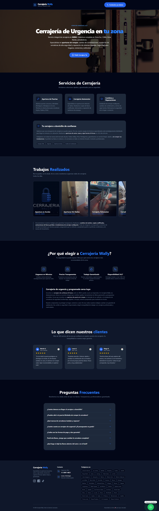
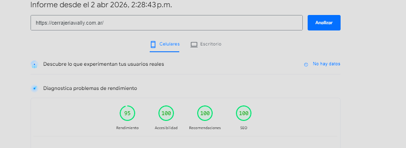
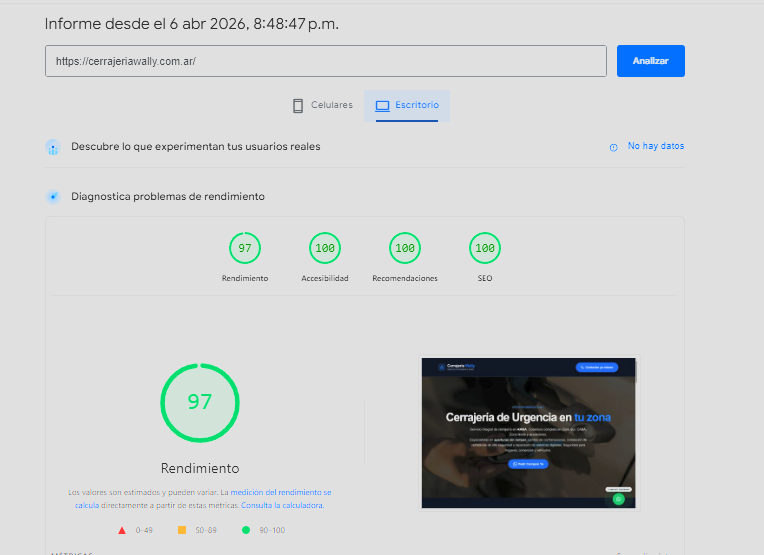

# 🔑 Cerrajería Wally - Landing Page de Alto Rendimiento

Sitio web estático de ultra-alta velocidad desarrollado para un servicio de cerrajería de urgencias 24 horas en Buenos Aires (CABA y GBA). 

El objetivo principal de este proyecto fue maximizar la conversión en dispositivos móviles bajo redes inestables (3G/4G), priorizando el **Performance** y el **SEO Local**.

## 🏆 Resultados de Rendimiento

El proyecto fue auditado con Google PageSpeed Insights, logrando una excelencia técnica en ambas plataformas y un **100/100 en SEO**.

### 📱 Dispositivos Móviles (95/100)

### 💻 Escritorio / Desktop (97/100)

* **LCP (Largest Contentful Paint):** Optimizado para cargar en menos de 1.5s.
* **CLS (Cumulative Layout Shift):** 0.00 (Estructura sólida sin saltos visuales).
* **TBT (Total Blocking Time):** Reducido a cero gracias a la postergación de scripts de terceros.

## 🛠️ Stack Tecnológico

* **Framework:** [Astro.js](https://astro.build/) (Arquitectura de Islas para generar HTML estático sin JS innecesario).
* **Estilos:** [Tailwind CSS](https://tailwindcss.com/) (Clases utilitarias y diseño responsive).
* **Scripts de Terceros:** [Partytown](https://partytown.builder.io/) (Ejecución de GTM en Web Workers).
* **Infraestructura:** Alojamiento en DonWeb con capa de distribución (CDN) y caché estática en **Cloudflare**.

## 🚀 Optimizaciones Clave Implementadas

### 1. Escudo de Interacción GTM (Anti-Bot)
Para evitar que Google Tag Manager y Google Analytics 4 arruinen el rendimiento inicial, se implementó un script personalizado que **retrasa la carga de GTM**. El script de seguimiento solo se inicializa cuando se detecta una interacción humana real (`scroll`, `touchstart`, `click`, `mousemove`), excluyendo explícitamente a los bots de Lighthouse (`navigator.webdriver`).

### 2. Arquitectura de SEO Local Dinámica
El sitio está estructurado para captar búsquedas de cola larga (Long-tail) basadas en ubicación. Se crearon rutas paramétricas para generar páginas específicas por zona (ej. `/lomas-de-zamora`, `/quilmes`), todas compartiendo el mismo componente Hero dinámico pero con meta-títulos y descripciones únicas.

### 3. SEO Semántico y Schema.org
Inyección de JSON-LD estructurado (`@type: "Locksmith"`) detallando rango de precios, área de cobertura (GeoCircle) y horarios de atención (24/7) para potenciar el Local Pack de Google Maps.

### 4. Optimización de Multimedia
* Imágenes convertidas a formato **WebP**.
* Precarga (`fetchpriority="high"`) para la imagen LCP del carrusel inicial mediante el componente `<Image>` de Astro.
* Carrusel en Vanilla JS con intervalo optimizado (8 segundos) para evitar penalizaciones de rendimiento en el hilo principal por repintado constante.
